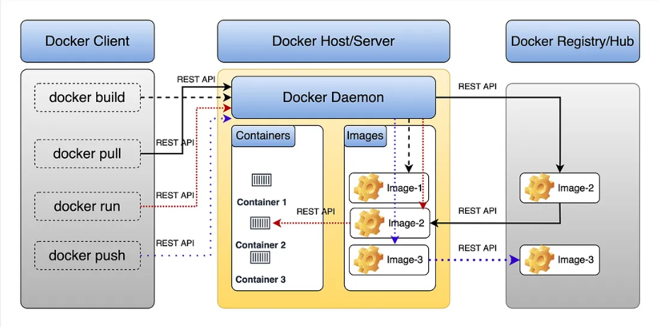

# Docker Architecture
Docker is a containerization platform that allows developers to create, deploy, and run applications in isolated environments called containers. The core of Docker's architecture includes several components, each playing a crucial role in the lifecycle of containers.

## 1. Docker CLI
The Docker Command-Line Interface (CLI) allows users to interact with Docker using simple commands. The CLI enables users to build images, run containers, manage volumes, networks, and much more.

### Common Docker CLI Commands:

```
# Build an image from a Dockerfile
docker build -t my-app .

# Run a container in detached mode and map port 8080 to 80
docker run -d -p 8080:80 my-app

# Stop a running container by its container ID or name
docker stop <container_id>

# Remove a container
docker rm <container_id>

# View logs of a running container
docker logs <container_id>

# List all running containers
docker ps

# List all containers (including stopped ones)
docker ps -a
```

# 2. Docker Daemon (dockerd)
The Docker Daemon runs as a background service on the host machine and listens for Docker API requests from the Docker CLI. It manages images, containers, networks, and volumes.

## Docker Daemon Commands:

```
# Start Docker Daemon (typically managed by the system)
sudo systemctl start docker

# Restart Docker Daemon
sudo systemctl restart docker

# Check Docker Daemon status
sudo systemctl status docker

# View logs of the Docker Daemon
journalctl -u docker.service

```


# 3. Containerd
containerd is a container runtime used by Docker to manage container lifecycle operations such as image pull, container start/stop, and volume/network management.

```
Containerd CLI Commands:
# Pull an image from Docker Hub via containerd
ctr image pull docker.io/library/nginx:latest

# List all images pulled by containerd
ctr images list

# Run a container using containerd
ctr run -d --rm docker.io/library/nginx:latest my-nginx

# List running containers
ctr task list
```


# 4. Containerd-shim
containerd-shim allows containers to keep running even if containerd crashes or is restarted. It operates as a lightweight process manager for each running container.

```
Inspect Containerd-shim Process:
# List all containerd-shim processes
ps aux | grep containerd-shim

# View containerd-shim logs (usually integrated with system logging)
journalctl -u containerd
```

# 5. Runc
runc is a low-level CLI tool that spawns and runs containers based on the Open Container Initiative (OCI) specification. It is the underlying tool used by Docker to start containers.

```
Runc Commands:
# Create and start a container with runc
runc run <container_id>

# List all running containers created with runc
runc list

# Delete a container created with runc
runc delete <container_id>

# View the state of a container
runc state <container_id>
```

# 6. Libcontainer
libcontainer is the library used by runc to interface directly with the kernel to manage container creation and isolation. You usually don’t interact with libcontainer directly, but it’s invoked by runc to create the container.

```
Example (invoked indirectly via runc):

# Use runc to start a container, which in turn uses libcontainer to interact with the kernel
runc run <container_id>
```

# 7. Namespaces
Namespaces provide isolation of system resources, such as process IDs (PID), network interfaces, and file systems. Each container runs in its own set of namespaces, isolating it from other containers and the host system.

```
Inspect Namespace of a Running Container:

# Get the process ID of the running container
docker inspect --format '{{.State.Pid}}' <container_id>

# Enter the network namespace of a running container
nsenter -t <pid> -n

```

# 8. Cgroups
Control Groups (cgroups) limit and isolate resource usage (CPU, memory, disk I/O, etc.) for a container. Docker uses cgroups to ensure that containers don’t overuse system resources.

```
Example of Setting Cgroup Limits:
# Limit container to use a maximum of 50% CPU and 512MB of memory
docker run --cpus=".5" --memory="512m" my-app

# Inspect cgroup limits of a running container
cat /sys/fs/cgroup/cpu/docker/<container_id>/cpu.cfs_quota_us
cat /sys/fs/cgroup/memory/docker/<container_id>/memory.limit_in_bytes
```
<dev>
Summary of Docker Architecture
Docker CLI is used to interact with Docker.
Docker Daemon (dockerd) listens for commands and manages Docker objects (containers, images, volumes, networks).
Containerd manages the lifecycle of containers, pulling images, and managing volumes and networks.
Containerd-shim ensures that containers can run independently of the containerd process.
Runc is responsible for creating containers as per the OCI specification.
Libcontainer interfaces with the kernel to isolate containers using namespaces and cgroups.
</dev>

# Diagram:

```mermaid
graph TD;
    A[Docker CLI] --> B[Reset API]
    B --> C[Docker Daemon]
    C --> D[Containerd]
    D --> E[Containerd-shim]
    E --> F[Runc]
    F --> G[Libcontainer (OCI)]
    G --> H1[Namespace (Process, Net, Mount, etc.)]
    G --> H2[Cgroups (CPU, Memory)]
    G --> H3[Filesystem (Image Layers)]


- OCI provides a unified set of specifications that make containers portable, consistent, and interoperable across different platforms and vendors

