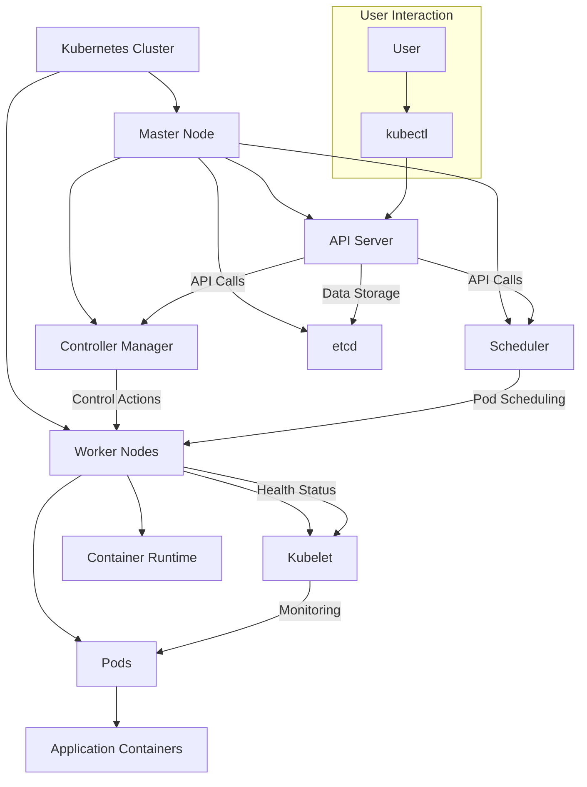

#  Kubernetes workflow diagram. 

      

# Explanation of the Diagram  
**User Interaction:** Users interact with the Kubernetes cluster using the kubectl command-line tool. 
**Master Node:** The control plane that manages the Kubernetes cluster. 
**API Server:** The main management component that handles REST requests and updates the state of the cluster. 
**Controller Manager:** Manages controllers that regulate the state of the cluster. 
**Scheduler:** Assigns workloads to the available worker nodes based on resource requirements. 
**etcd:** A distributed key-value store that holds all the cluster data. 
**Worker Nodes:** The machines that run the application workloads. 
**Kubelet:** An agent that runs on each worker node, ensuring that containers are running in a pod. 
**Container Runtime:** Software responsible for running containers (e.g., Docker, containerd). 
**Pods:** The smallest deployable units in Kubernetes that can hold one or more containers. 
**Application Containers:** The actual applications running inside the pods. 

  

# Kubernetes main components:
**Control Plane Components**  
*API Server: *Central control point for Kubernetes. 
*etcd:* Stores all cluster data. 
*Controller Manager:* Manages controllers (e.g., node, replication). 
*Scheduler:* Assigns pods to nodes. 
*Cloud Controller Manager:* Manages cloud provider interactions.  
**Node Components** 
*Kubelet:* Runs on each node, manages containers. 
*Kube Proxy:* Handles networking for pods. 
*Container Runtime:* Runs containers (e.g., Docker, containerd).  
**Networking** 
*Service:* Exposes pods (ClusterIP, NodePort, LoadBalancer). 
*Ingress Controller:* Manages external access.  
**Storage** 
*Persistent Volumes (PV):* Allocates storage. 
*Persistent Volume Claims (PVC):* Requests storage. 
*Storage Classes:* Defines storage types.  
**Config and Secrets** 
*ConfigMaps:* Stores configuration data. 
*Secrets: *Stores sensitive information.  
**Monitoring and Logging** 
*Metrics Server:* Collects resource metrics. 
*Prometheus: *Monitoring solution. 
*Grafana:* Metrics visualization.  
**Others** 
*Namespaces: *Isolates resources. 
*CRDs:* Extend Kubernetes with custom resources. 
*kubectl:* CLI for managing the cluster. 
*Helm:* Kubernetes package manager. 
*ArgoCD: *GitOps continuous delivery tool for Kubernetes, syncing manifests from Git 