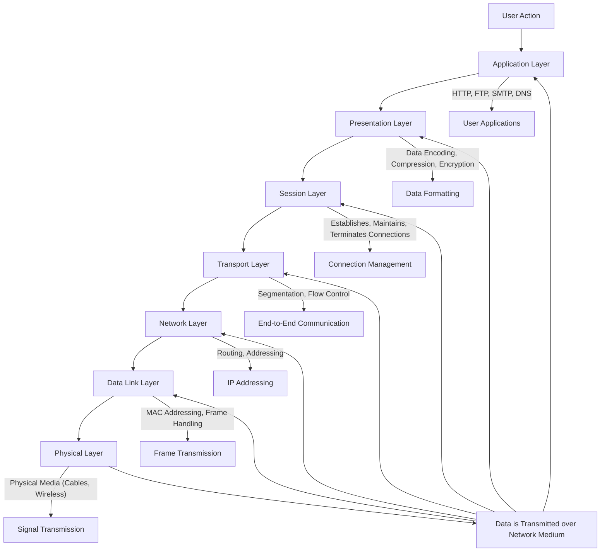
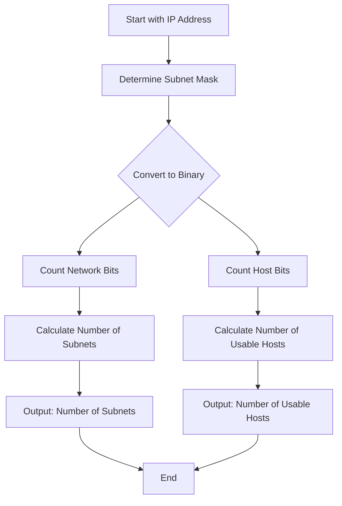

# OSI Model Layers

## 1. Layer 1: Physical Layer
**Purpose**: This layer deals with the physical connection between devices and the transmission of raw binary data (bits) over that physical medium.

**Functions**:
- Defines hardware elements like cables, switches, network interface cards (NICs), and electrical signals.
- Handles the transmission and reception of the unstructured raw data as 1s and 0s (bits).
- Determines how to physically connect network devices (e.g., electrical signals, light pulses in fiber optics).

**Devices/Protocols**:
- Ethernet cables, fiber optics, Wi-Fi, hubs, repeaters.
- **Example**: The electrical voltage changes or light pulses used in fiber optic cables.

## 2. Layer 2: Data Link Layer
**Purpose**: This layer ensures reliable data transfer between adjacent network nodes by organizing the bits into frames and managing error detection and correction.

**Functions**:
- Divides data into frames and provides physical addressing (MAC addresses).
- Detects and potentially corrects errors that may occur in the Physical Layer.
- Controls access to the physical transmission medium (e.g., which device gets to use the network at a given time).

**Devices/Protocols**:
- Switches, bridges, MAC addresses, ARP (Address Resolution Protocol).
- **Example**: Your computer’s NIC uses a MAC address (unique to each device) to send data to another device on the same local network.

## 3. Layer 3: Network Layer
**Purpose**: The Network Layer is responsible for routing packets across different networks, ensuring they arrive at the correct destination.

**Functions**:
- Handles logical addressing (IP addresses) and determines the best path for data to travel across the network using routing algorithms.
- It segments data into packets for transmission and assembles them at the receiving end.
- Manages traffic control and congestion.

**Devices/Protocols**:
- Routers, IP (Internet Protocol), ICMP (Internet Control Message Protocol), OSPF (Open Shortest Path First).
- **Example**: When you send data to a remote server, Layer 3 is responsible for figuring out how to get the data from your device to the server across multiple networks.

## 4. Layer 4: Transport Layer
**Purpose**: This layer ensures reliable data transfer between devices and manages error correction, flow control, and data segmentation.

**Functions**:
- Breaks large chunks of data into smaller segments and reassembles them at the destination.
- Provides error checking and guarantees that data arrives intact.
- Handles flow control (manages data rate so that the sender doesn’t overwhelm the receiver).
- Establishes and maintains connections between devices (in the case of TCP).

**Protocols**:
- **TCP (Transmission Control Protocol)**: Reliable, ensures data is delivered without errors.
- **UDP (User Datagram Protocol)**: Faster but doesn’t guarantee reliable data delivery.
- **Example**: TCP establishes a connection using a three-way handshake (SYN, SYN-ACK, ACK) before data transmission, ensuring that both sides are ready for communication.

## 5. Layer 5: Session Layer
**Purpose**: The Session Layer manages and controls connections between devices, handling the setup, maintenance, and termination of communication sessions.

**Functions**:
- Establishes, manages, and terminates sessions between applications.
- Provides synchronization, ensuring that data exchange occurs in an organized and coordinated way.
- Allows for full-duplex or half-duplex communication (determining whether communication can occur in both directions simultaneously or alternately).

- **Example**: When you log into a remote server using an application like SSH, Layer 5 handles the session's initiation and manages it while you're logged in.

## 6. Layer 6: Presentation Layer
**Purpose**: The Presentation Layer is responsible for translating data into a format that the application can understand, handling encryption, compression, and data encoding.

**Functions**:
- **Data Translation**: Converts data from one format to another (e.g., converting file formats or translating between different character encodings like ASCII to Unicode).
- **Data Compression**: Reduces the size of the data to improve transmission efficiency.
- **Data Encryption**: Encrypts and decrypts data for security during transmission (e.g., SSL/TLS).

**Protocols**:
- JPEG, GIF, MPEG (multimedia data formats).
- SSL/TLS (for encryption in secure web connections).
- **Example**: When you view an image on a website, the Presentation Layer translates the JPEG file into data the browser can display.

## 7. Layer 7: Application Layer
**Purpose**: The Application Layer provides network services to end-users and is the layer where communication with network applications occurs.

**Functions**:
- It serves as the interface between the network and the user’s applications.
- Responsible for supporting network applications like web browsers, email clients, and file transfer applications.
- Provides protocols and services such as HTTP, FTP, SMTP, DNS, etc.

**Protocols**:
- HTTP/HTTPS (for web browsing).
- FTP (for file transfers).
- SMTP/IMAP (for emails).
- DNS (for translating domain names into IP addresses).
- **Example**: When you type a URL in your web browser, the Application Layer uses the HTTP/HTTPS protocol to request data from the web server.


# Summary Table of the OSI Model:

|Layer |	Name |	Description	|Examples|
|-----|-----|------|-------|
| Layer 7 |	Application  |	Provides services for network applications  | 	HTTP, FTP, SMTP, DNS |
| Layer 6 |	Presentation |	Translates, encrypts, and compresses data	| SSL/TLS, JPEG, ASCII|
| Layer 5	|   Session	     |  Manages sessions between applications	    | SSH, RPC, NetBIOS|
| Layer 4 |   Transport	 | Provides reliable or unreliable data transmission |	TCP, UDP|
| Layer 3	|   Network	     |  Routes data and provides logical addressing (IP addresses) |	IP, ICMP, OSPF, BGP|
| Layer 2	|   Data Link	 | Ensures data transfer between adjacent network nodes |	Ethernet, Wi-Fi, MAC addresses|
| Layer 1	|   Physical	 | Transmits raw bits over a physical medium |	Cables, Fiber optics, Wi-Fi|


# OSI Model workflow:


-------
<br><br>
# 1. Local PC to Router (LAN Connection)

## a. Hardware Setup
- Your local PC connects to a router via Wi-Fi or Ethernet cable.
- The router acts as the gateway between your home’s Local Area Network (LAN) and the external internet.

## b. Network Interface Configuration
- Your PC has a Network Interface Card (NIC) that connects to the network. It handles communication with the router.
- When your PC boots up, it will request an IP address from the router via DHCP (Dynamic Host Configuration Protocol). The router provides an internal (private) IP address to the PC, like `192.168.1.5`.

## c. Private IP Address
- Devices on a LAN use private IP addresses for communication within the network. Private IP ranges are:
  - `10.0.0.0 - 10.255.255.255`
  - `172.16.0.0 - 172.31.255.255`
  - `192.168.0.0 - 192.168.255.255`

## d. MAC Address and ARP
- Every device's NIC has a MAC address (a unique identifier). The router uses ARP (Address Resolution Protocol) to map the device's MAC address to its assigned private IP address.
- **Example**: When your PC connects to the router, it may get the IP address `192.168.1.5`, and your phone may get `192.168.1.6`. These are used for communication inside your home network.

---

# 2. Router to ISP (NAT and Public IP Address)

## a. Network Address Translation (NAT)
- NAT is used by your router to translate private IP addresses used inside your LAN to a public IP address provided by your ISP. This enables devices on your local network to communicate with the internet.
  
### Example:
- Your router’s private IP: `192.168.1.1`
- Your PC’s private IP: `192.168.1.5`
- ISP assigns a public IP: `123.45.67.89` (the IP visible on the internet)

When your PC sends data to the internet, the router replaces the source private IP (`192.168.1.5`) with the public IP (`123.45.67.89`) in the data packets, making it appear as though the data is coming from your public IP address.

## b. Default Gateway
- The default gateway is the router’s IP address, often `192.168.1.1`, which acts as the next hop for any data leaving your PC. Any request to an external IP address first goes to the default gateway (the router).

## c. Public IP Address
- ISPs provide your router with a public IP address. This can be static (permanently assigned) or dynamic (temporarily assigned) through DHCP.

## d. DNS Resolution (Domain Name System)
- When you try to access a website (e.g., `www.example.com`), your PC sends a request to a DNS server (often provided by the ISP) to translate the domain name into an IP address.

### Example:
- `www.example.com` → `93.184.216.34`
  
This IP address is used to connect to the destination server.

---

# 3. ISP to Internet Backbone

## a. Internet Service Provider (ISP)
- Once your router sends data through the default gateway, it reaches your ISP, which routes your traffic to the internet via its own network infrastructure.
- The ISP assigns your public IP address (e.g., `123.45.67.89`) and handles routing your data to its destination on the internet.

## b. Routing to Internet Backbone
- The ISP communicates with other networks via peering agreements and routes your data through routers and switches.
- Routers use routing tables and protocols (like BGP – Border Gateway Protocol) to determine the best path for your data across the global internet backbone (a collection of high-speed data links and core routers).

## c. Return Path
- When you request a webpage or any internet service, the server on the internet responds. The data then follows the reverse route back to your ISP, which delivers it to your router, and finally to your PC.

---

# 4. Connectivity Process Flow (Step-by-Step)

## Example: Browsing a Website from a Local PC

### LAN Connection (Local Network):
1. Your PC connects to the router either via Wi-Fi or Ethernet.
2. The router assigns your PC a private IP address (e.g., `192.168.1.5`) using DHCP.

### DNS Query (Resolving a Domain):
1. You type `www.example.com` into your browser.
2. The browser sends a request to a DNS server (managed by your ISP or a public DNS like Google’s `8.8.8.8`) to get the IP address of `www.example.com`.
3. The DNS server replies with `93.184.216.34` (the server’s IP address).

### Data Packet Creation:
1. Your PC creates a data packet containing the HTTP request to access the website.
2. The packet’s source IP address is your private IP (`192.168.1.5`), and the destination IP is `93.184.216.34` (the website’s server).

### Routing to the ISP (NAT):
1. The packet is sent to the router (`192.168.1.1`), which performs NAT.
2. The router replaces your private IP (`192.168.1.5`) with your public IP (`123.45.67.89`) and forwards the packet to your ISP.

### ISP to Internet:
1. The ISP routes the packet across the internet to the destination server’s IP address (`93.184.216.34`).
2. The packet traverses multiple routers and networks as it crosses the internet backbone.

### Response from Server:
1. The server processes your request and sends back a response (e.g., the website’s data).
2. The response travels back through the internet backbone, to your ISP, and then to your router.

### Return to Local PC:
1. The router receives the packet, performs reverse NAT (translates the public IP back to your private IP), and forwards the response to your PC (`192.168.1.5`).

### Website Displayed:
1. Your browser assembles the response, and the website is displayed on your screen.

---

# Summary:
- **Local PC (LAN)**: Your PC gets a private IP from the router, which acts as the gateway to the internet.
- **Router (NAT)**: The router translates between private and public IPs using NAT and forwards data to the ISP.
- **ISP**: Your ISP routes data between your router and the global internet, using your public IP.
- **Internet Backbone**: Data travels through routers and networks to reach the destination server.
- **Return Path**: The server sends data back along the same route, ultimately reaching your PC.


# Local PC to Router

```mermaid
flowchart TD
    A[User Action: Access Internet from Local PC] --> B[Application Layer (HTTP, DNS)]
    B --> C[Transport Layer (TCP/UDP)]
    C --> D[Network Layer (IP Address Resolution)]
    D --> E[Data Link Layer (Ethernet/Wi-Fi)]
    E --> F[Physical Layer (Ethernet Cable, Wireless Signal)]
    
    F --> G[Router: Local Network Gateway]
    G --> H[Router Checks Routing Table]
    H --> I[Router Forwards Packet to ISP]

    I --> J[ISP's Network Infrastructure]
    J --> K[ISP Routes Packet to Internet Backbone]
    K --> L[Internet Backbone Routes to Destination Server]
    
    L --> M[Server Receives Data Packet]
    M --> N[Server Processes Request (Application Layer)]
    N --> O[Server Sends Response Back Through Same Layers]
    
    O --> P[Response Travels Back Through Internet Backbone]
    P --> Q[ISP Receives Response]
    Q --> R[Router Receives Data]
    R --> S[Router Forwards Data to Local PC]
    
    S --> T[Local PC Receives Response (Physical Layer)]
    T --> U[Data Moves Up Through Data Link Layer]
    U --> V[Network Layer (IP Verification)]
    V --> W[Transport Layer (TCP/UDP Reassembly)]
    W --> X[Application Layer (HTTP, Browser Displays Content)]

```
--------
<br><br>

------

# Explanation of Subnetting

Subnetting is the practice of dividing a larger IP network into smaller, manageable sub-networks (subnets). This allows for more efficient IP address management and improves network performance and security. Subnetting helps in organizing a network, reducing broadcast traffic, and allocating IP addresses more efficiently.

## Key Concepts in Subnetting

### IP Address
An IP address consists of two parts:

- **Network Part**: Identifies the specific network.
- **Host Part**: Identifies a specific device within that network.

### Subnet Mask
A subnet mask determines which portion of an IP address is the network part and which part is the host part. It is usually expressed in either:

- **Dotted Decimal Notation**: e.g., `255.255.255.0`
- **CIDR (Classless Inter-Domain Routing) Notation**: e.g., `/24` (which means the first 24 bits are for the network part).

### Subnetting Classes
- **Class A**:
  - Default Subnet Mask: `255.0.0.0` or `/8`
  - Supports a large number of hosts (up to 16 million)
  
- **Class B**:
  - Default Subnet Mask: `255.255.0.0` or `/16`
  - Supports up to 65,536 hosts
  
- **Class C**:
  - Default Subnet Mask: `255.255.255.0` or `/24`
  - Supports up to 256 hosts

## Subnet Calculation

To calculate the number of available subnets and hosts in a subnet, follow these steps:

### 1. Determine the Subnet Mask
- Convert the subnet mask to binary to identify how many bits are used for the network and host parts.

### 2. Calculate the Number of Subnets
If you are borrowing `n` bits from the host part, the number of subnets can be calculated as:

\[
\text{Number of Subnets} = 2^n
\]

### 3. Calculate the Number of Hosts per Subnet
The formula for calculating the number of usable hosts in a subnet is:

\[
\text{Number of Usable Hosts} = 2^{(32 - \text{number of bits in subnet mask})} - 2
\]

The `-2` accounts for the network and broadcast addresses, which cannot be assigned to hosts.

## Example Calculation

Let’s say we have the following scenario:

- **IP Address**: `192.168.1.0`
- **Subnet Mask**: `255.255.255.192`

### Step 1: Convert Subnet Mask to Binary
`255.255.255.192` in binary is:

11111111.11111111.11111111.11000000


This means:
- **Network bits**: 26 (the first 26 bits are for the network)
- **Host bits**: 6 (the last 6 bits are for the hosts)

### Step 2: Calculate the Number of Subnets
If you are borrowing 2 bits (to create subnets) from the host part, the number of subnets is:

\[
\text{Number of Subnets} = 2^2 = 4
\]

### Step 3: Calculate the Number of Usable Hosts
The number of usable hosts can be calculated as:

\[
\text{Number of Usable Hosts} = 2^{(32 - 26)} - 2 = 2^6 - 2 = 64 - 2 = 62
\]

## Summary
For `192.168.1.0/26`, we can create **4 subnets**, and each subnet can have **62 usable hosts**.


# Workflow diagram of Subnetting


<br><br>

# Here’s a workflow diagram representing IP classes, subnetting, and configuration processes in Linux

```mermaid
flowchart TD
    A[Start Configuration] --> B{Select IP Class}
    B -->|Class A| C[IP Range: 1.0.0.0 to 126.255.255.255]
    B -->|Class B| D[IP Range: 128.0.0.0 to 191.255.255.255]
    B -->|Class C| E[IP Range: 192.0.0.0 to 223.255.255.255]
    B -->|Class D| F[IP Range: 224.0.0.0 to 239.255.255.255 (Multicast)]
    B -->|Class E| G[IP Range: 240.0.0.0 to 255.255.255.255 (Experimental)]

    C --> H[Subnetting Class A]
    D --> I[Subnetting Class B]
    E --> J[Subnetting Class C]

    H --> K[Determine Subnet Mask]
    I --> L[Determine Subnet Mask]
    J --> M[Determine Subnet Mask]

    K --> N[Configure Network Interface in Linux]
    L --> N
    M --> N

    N --> O{Choose Interface Type}
    O -->|Host| P[Configure Static or DHCP IP]
    O -->|Bridge| Q[Configure Bridge Interface]

    P --> R[Apply Configuration]
    Q --> R

    R --> S[Verification]
    S --> T[Check Connectivity with ping]
    S --> U[Check IP Configuration with ifconfig or ip addr]
    S --> V[Exit Configuration Process]

```
<br><br>
-------

# The HTTP Journey from Your Local PC to a Web Server (and Back)

The HTTP journey from your local PC to a web server (and back) can be broken down into a series of steps that occur when you request a webpage. This journey includes several key processes like DNS resolution, establishing a connection, sending and receiving data, and rendering the requested content.

## Step-by-Step Process of HTTP's Journey

### 1. User Action: Requesting a Webpage
- You open your browser (e.g., Chrome, Firefox) and type a URL like `https://www.example.com` or click a link.
- The URL contains:
  - **Protocol**: HTTP or HTTPS (`https://`)
  - **Domain name**: `www.example.com`
  - **Path**: `/about` (optional)

### 2. DNS Lookup: Converting Domain to IP Address
- The browser checks its DNS cache first to see if it already knows the IP address of `www.example.com`. If not:
  - **DNS Query**: The browser sends a query to a DNS server (often provided by your ISP or a public DNS service like Google DNS at `8.8.8.8`).
  - The DNS server resolves the domain name `www.example.com` into an IP address, such as `93.184.216.34`.
  - The browser now knows which server (by IP address) to contact to get the webpage.

### 3. Establishing a TCP Connection
- The browser initiates a TCP connection to the server at the resolved IP address (`93.184.216.34`).
- This process involves a three-way handshake:
  - The browser sends a **SYN** (synchronize) packet to the server to initiate the connection.
  - The server responds with a **SYN-ACK** (synchronize-acknowledge) packet.
  - The browser replies with an **ACK** (acknowledge) packet, completing the handshake.
  
Now, there’s a reliable connection between your PC and the web server.

### 4. Establishing an HTTPS Connection (If Using HTTPS)
- If the URL starts with `https://`, the browser and server perform a TLS (Transport Layer Security) handshake after the TCP connection is established:
  - **Certificate Exchange**: The server sends its SSL/TLS certificate to prove its identity.
  - **Encryption Keys**: The browser and server exchange encryption keys.
  - **Secure Channel**: All further communication is encrypted to ensure data integrity and security.
  
Once the TLS handshake is complete, the connection is secure.

### 5. Sending the HTTP Request
- With the connection established, the browser sends an HTTP request to the server. This request typically uses the **GET** method to request a webpage (or **POST**, **PUT**, **DELETE**, etc., for other types of operations).
  
**Example of a GET Request:**
GET /about HTTP/1.1 Host: www.example.com User-Agent: Mozilla/5.0 (Windows NT 10.0; Win64; x64) Accept: text/html

- The request includes:
  - **Method**: GET (used to request a resource, like a webpage)
  - **URL path**: `/about` (the specific page or resource being requested)
  - **Headers**: Additional metadata, such as `User-Agent` (browser info), `Accept` (types of content you accept), and the `Host` (domain name).

### 6. Server Processing the Request
- The web server (e.g., Apache, NGINX, or another server) receives the HTTP request and processes it:
  - **Routing**: The server determines which resource (e.g., an HTML file or a dynamic script) corresponds to the requested path (`/about`).
  - **Backend Logic**: For dynamic content, the server may interact with databases, APIs, or backend scripts (written in PHP, Python, Node.js, etc.).
  - **Generating a Response**: Once the server processes the request, it prepares an HTTP response containing the requested resource (e.g., an HTML page or JSON data).

### 7. Sending the HTTP Response
- The server sends back an HTTP response to the browser, containing:
  - **Status Line**: Indicates the status of the request (e.g., `HTTP/1.1 200 OK` for success).
  - **Headers**: Information about the response, such as `Content-Type` (e.g., `text/html` for an HTML page) and `Content-Length` (size of the response).
  - **Body**: The actual content (e.g., the HTML markup of the webpage).

**Example of a Response (HTML page):**

```
HTTP/1.1 200 OK Content-Type: text/html Content-Length: 3456

<html> <head><title>About Us</title></head> <body> <h1>Welcome to our website!</h1> </body> </html> 
```
### 8. Browser Receives and Processes the Response
- The browser receives the HTTP response and begins processing it:
  - **Status Code:** If the status code is 200 OK, the request was successful, and the browser continues rendering the page.
  - **Body:** The browser processes the content in the response body (e.g., HTML) and begins to render it.
If the page includes additional resources (like images, CSS files, or JavaScript), the browser makes additional HTTP requests to fetch those files in parallel.

### 9. Rendering the Webpage
- The browser parses the HTML, applies CSS for styling, and runs JavaScript to build the final visual representation of the webpage.
- The browser constructs the DOM (Document Object Model), which represents the structure of the webpage.
- Once all resources are loaded and processed, the browser displays the fully rendered page to the user.

### 10. Connection Termination
- After the browser has received and rendered the webpage (and any additional resources), the TCP connection may be closed.
- Modern browsers and HTTP/1.1 support persistent connections, which means the same TCP connection may be reused for additional requests to the server (e.g., for images, CSS files).
- If the connection isn’t needed anymore, it is gracefully terminated.


## Summary of HTTP Journey:
- **DNS Lookup**: The browser converts the domain name into an IP address using a DNS server.
- **TCP Handshake**: A reliable connection is established between your PC and the web server.
- **TLS Handshake (if HTTPS)**: If HTTPS is used, an encrypted channel is created.
- **HTTP Request**: The browser sends a request to the server for the desired resource (e.g., a webpage).
- **Server Processing**: The server processes the request, potentially interacting with backend services.
- **HTTP Response**: The server sends back a response, including the requested resource and metadata.
- **Browser Rendering**: The browser processes the response, fetching additional resources if needed, and renders the webpage.
- **Connection Termination**: The connection is closed (or reused for additional requests).


# Workflow diagram of HTTP

```mermaid
flowchart TD
    A[User Requests a Webpage] --> B[DNS Lookup]
    B --> C[DNS Server Returns IP Address]
    C --> D[Establish TCP Connection]
    D --> E{Using HTTPS?}
    E -->|Yes| F[Perform TLS Handshake]
    E -->|No| G[Proceed Without Encryption]
    F --> H[Send HTTP Request]
    G --> H[Send HTTP Request]
    
    H --> I[Web Server Receives Request]
    I --> J{Is it Static or Dynamic Resource?}
    J -->|Static| K[Serve Static Resource (HTML, CSS, etc.)]
    J -->|Dynamic| L[Process via Backend Logic (Database, APIs, etc.)]
    
    K --> M[Generate HTTP Response]
    L --> M[Generate HTTP Response]
    
    M --> N[Send HTTP Response to Browser]
    N --> O{Status Code 200?}
    O -->|Yes| P[Browser Parses and Renders HTML]
    O -->|No| Q[Display Error Message]
    
    P --> R[Fetch Additional Resources (CSS, JS, Images)]
    R --> S[Render Complete Webpage]
    S --> T[Terminate or Reuse Connection]
    
    Q --> T[Terminate or Reuse Connection]

```
